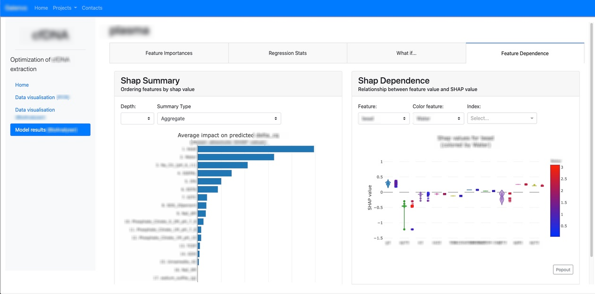
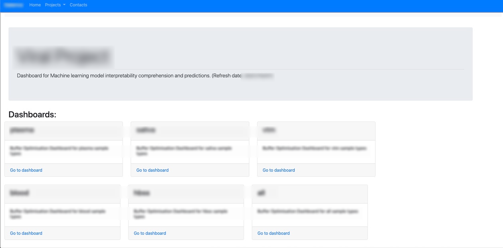
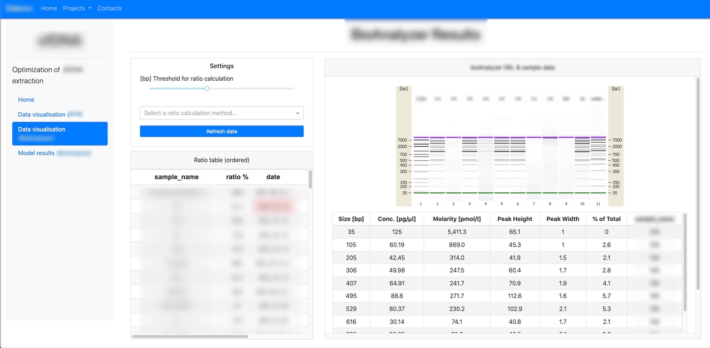

Flask factory template

Template to build a portal containing multiple flask web application.

When adding a new application, 
you need to add first your application to Dashapps, 
then add the link in the index. and navbar, and also add it to the routing.

based on https://towardsdatascience.com/embed-multiple-dash-apps-in-flask-with-microsoft-authenticatio-44b734f74532

To launch the dashboard:

1. make sur you are in the correct folder.
2. type in terminal: 'sh run.sh'
3. you can change the sh script to modify launch with nohup or not

Here are some examples of web apps built using this type of framework.

